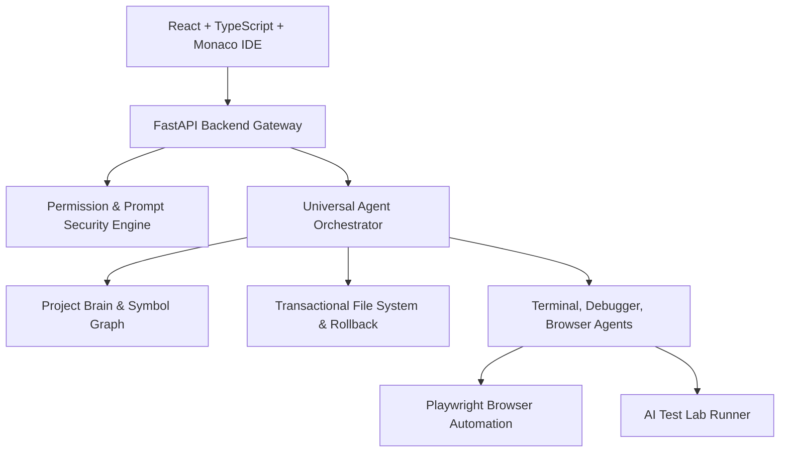

# DevPilot System Architecture

DevPilot is an AI-native developer operating system engineered around autonomous multi-agent software engineering, continuous codebase indexing, transactional state management, and failure-closed security boundaries.

## System Subsystems

1. **Frontend Core (`frontend/src`)**:
   - Monaco Editor with multi-cursor, next-edit prediction, FIM completions, and sticky scroll.
   - React state providers (`AIContext`, `WorkspaceContext`, `EditorContext`, `GitContext`, `LSPContext`).
   - Visual panels: Universal Command Center (`Ctrl+K`), Agent Timeline, Browser Panel, AI Test Lab.

2. **Backend Core (`backend/app`)**:
   - `orchestrator.py`: Multi-step state machine (`UNDERSTAND` → `PLAN` → `APPROVAL` → `EXECUTE` → `VERIFY` → `REPAIR` → `REVIEW` → `FINAL VERIFY` → `COMPLETE`).
   - `permissions.py`: 14 capability categories (`READ_FILES`, `WRITE_FILES`, `RUN_COMMAND`, etc.) under `Safe`, `Balanced`, `Autonomous`, `Custom` policies.
   - `transactional_fs.py`: Per-task atomic file change sets with instant rollbacks and unified diffs.
   - `prompt_security.py`: Boundary tags `<UNTRUSTED_CONTENT>` protecting system instructions against repository prompt injection.

3. **Runtime & Integrations**:
   - `inspect_route.py` & Playwright: Visual screenshots, console log interception, network monitoring.
   - `debug.py`: Structured call stack, scope variables, exception breakpoint inspection.
   - `database_route.py`: SQLite schema exploration, safe query execution, and explain plans.
