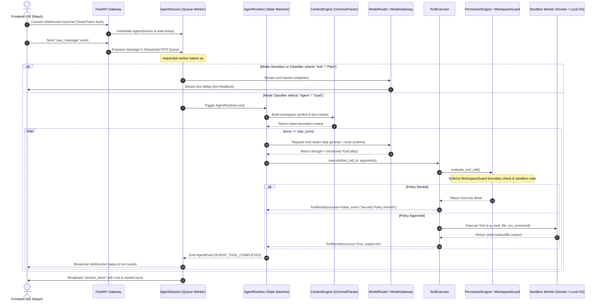

# Architecture Map — DevPilot IDE Platform

This document diagrams and traces the lifecycle of user prompts, agent decisions, and tool executions throughout the DevPilot codebase.

---

## 1. Request Flow Diagram

---

## 2. Alternate Execution Paths (Audited)

We audited the codebase for paths that bypass the canonical flow:

1. **Bypassing `AgentRuntime`:**
   - **Heuristic routing in `AgentSession.handle_user_message`:** When the user query is classified as `"Ask"` or `"Plan"`, the session executes a local tool-calling loop directly inside `agent_session.py` (lines 1238–1300).
   - **Impact:** This bypasses the canonical `AgentRuntime` state machine (e.g. `AgentState` transition validations are omitted or handled loosely), leading to inconsistent event emissions.
2. **Bypassing `ToolExecutor` / `PermissionEngine`:**
   - **Direct tool imports inside other tools:** For example, `dispatcher.py` handles some MCP and agent delegation calls locally instead of piping them through `ToolExecutor.execute()`. This bypasses `PermissionEngine`'s pre-evaluation checks.
3. **Bypassing `WorkspaceGuard`:**
   - **Direct file access in routers:** Route handlers like [routes/files.py](file:///e:/os%20kernel%20with%20ani/ai_coding_assistant/backend/app/routes/files.py) and [routes/git.py](file:///e:/os%20kernel%20with%20ani/ai_coding_assistant/backend/app/routes/git.py) use `safe_path` from [files.py](file:///e:/os%20kernel%20with%20ani/ai_coding_assistant/backend/app/files.py) to resolve paths, which resolves relative paths but does not perform symlink checks or use the canonical `WorkspaceGuard` object.

---

## 3. Asynchronous Execution & Event Routing

- **WebSocket Connection:** Established via `APIRouter.websocket("/ws/chat")` in [chat.py](file:///e:/os%20kernel%20with%20ani/ai_coding_assistant/backend/app/routes/chat.py). Events are serialized to JSON.
- **FIFO Task Queue:** `AgentSession` implements `asyncio.Queue(maxsize=10)` to buffer client messages. A dedicated worker task runs sequentially to prevent overlapping agent calls.
- **Event Bus:** An `EventBus` class in [orchestrator.py](file:///e:/os%20kernel%20with%20ani/ai_coding_assistant/backend/app/orchestrator.py) handles pub/sub events locally in memory.
