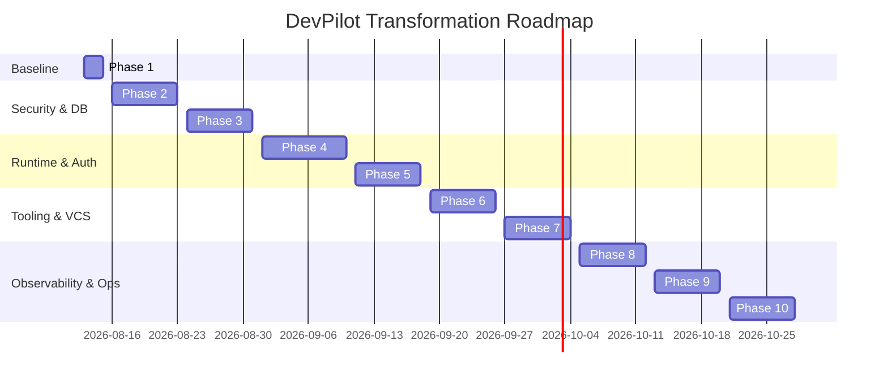

# Production Roadmap — DevPilot IDE Platform

This document details the 10-phase migration timeline, mapping every identified P0/P1/P2 risk to specific milestones for production-grade transformation.

---

## 1. 10-Phase Timeline Outline

---

## 2. Phase-by-Phase Execution Details

### Phase 1 — Audit/Stabilization (Current Phase)
* **Goal:** Audit codebase structure, identify risks, and fix immediate correctness bugs.
* **Scope:** 
  - Produce initial security and architecture inventory reports.
  - Stabilize CI pipeline test path directories and coverage focuses.
* **Risks Addressed:** Broken CI checks.

### Phase 2 — Sandbox & Secure Execution
* **Goal:** Enforce strict containerization for code and shell executions.
* **Scope:**
  - Remove silent host shell execution fallbacks.
  - Implement read-only base directories and isolated scratch mounts for container workspaces.
  - Replace regex checks with seccomp/cgroup process limit configurations.
* **Risks Addressed:** P0-001 (Host compromise/sandbox escape).

### Phase 3 — PostgreSQL & Multi-tenancy
* **Goal:** Migrate persistence to PostgreSQL and establish tenant boundaries.
* **Scope:**
  - Initialize Alembic migrations configuration and remove PRAGMA SQLite migrators.
  - Introduce organizations, memberships, and tenant-scoped workspace mapping tables.
* **Risks Addressed:** P0-004 (Tenant isolation bypasses), SQLite structural failures.

### Phase 4 — Durable Agent Runtime & Workers
* **Goal:** Eliminate volatile in-memory states and secure job workers.
* **Scope:**
  - Persist AgentRun, AgentTask, and AgentStep state histories directly to database.
  - Migrate cancel events and session maps to Redis.
  - Implement lease/heartbeat workers for job crash recovery.
* **Risks Addressed:** P1-002 (In-memory state loss), lack of crash recovery.

### Phase 5 — Security/Auth/Audit
* **Goal:** Centralize authentication and audit logs.
* **Scope:**
  - Enforce RBAC permissions (OWNER, ADMIN, DEVELOPER, etc.).
  - Implement the suspend-and-resume approval loop in `ToolExecutor`.
  - Store audit logs transactionally in PostgreSQL.
* **Risks Addressed:** P0-003 (Approval loop bypass), P0-005 (Auth token fallback).

### Phase 6 — Tool/Model/Context/Verification
* **Goal:** Refactor ToolExecutor and RAG interfaces.
* **Scope:**
  - Refactor `safe_path` to resolve symlinks canonically via `WorkspaceGuard`.
  - Create a generic `VectorStore` adapter to decouple ChromaDB.
* **Risks Addressed:** P0-002 (Symlink path traversal).

### Phase 7 — Reliability/Concurrency/Browser/Git
* **Goal:** Secure concurrency, browser services, and Git scopes.
* **Scope:**
  - Implement Redis-backed workspace locks to prevent overlapping writes.
  - Move Playwright browser execution to a separate isolated worker service.
* **Risks Addressed:** P1-001 (Volatile global state).

### Phase 8 — Observability/Performance/Cost
* **Goal:** Integrate OpenTelemetry tracing and budget circuit breakers.
* **Scope:**
  - Implement OpenTelemetry spans tracking requests, tool calls, and model durations.
  - Enforce hard budget usd limits in the runtime loop.

### Phase 9 — Testing/CI/CD/AI Evaluation
* **Goal:** Harden release gates.
* **Scope:**
  - Add bandit static scans and gitleaks secret scans in GitHub Actions.
  - Implement concurrency simulation test suites.

### Phase 10 — Production Deployment/DR
* **Goal:** Staging/Production deployments setup.
* **Scope:**
  - Setup container orchestration configurations (Kubernetes / ECS).
  - Configure automated database backup and point-in-time recovery validations.
